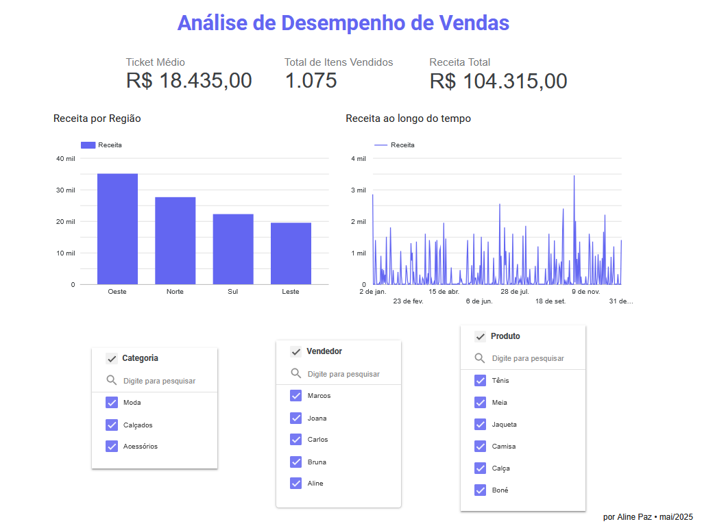

## 📊 Dashboard de Vendas - Looker Studio

Este é um projeto de visualização de dados utilizando o **Google Looker Studio**. Os dados utilizados são fictícios, mas foram criados de forma realista para simular um cenário de vendas.

## 💡 Objetivo

Este projeto tem como finalidade demonstrar habilidades em:

- Criação de dashboards interativos
- Organização e limpeza de dados
- Apresentação de KPIs de forma visual e objetiva
- Uso de ferramentas no ecossistema Google para análise de dados

---

## 🧾 Conjunto de Dados

- Fonte: Dataset fictício criado com ajuda do ChatGPT para fins de portfólio.
- Formato: `.csv`
- Campos: Categoria, Data, Produto, Preço Unitário, Quantidade, Receita, Região e Vendedor.

📁 Arquivo disponível em: `dados/dados_vendas_looker_studio.csv`

## ⚙️ Funcionalidades

- Cartões de KPIs com Receita Total, Quantidade Vendida e Preço Médio
- Gráficos dinâmicos para análise de performance por:
  - Produto
  - Categoria
  - Região
  - Vendedor
- Segmentações e filtros interativos por período, região, produto e vendedor
- Layout limpo e responsivo com foco na usabilidade

---

## 📌 Principais Insights

- **Receita Consolidada**: Permite avaliação rápida da performance geral de vendas.
- **Ranking de Vendedores**: Identifica os melhores desempenhos e oportunidades de melhoria.
- **Análise Temporal**: Traz visualizações que evidenciam sazonalidade e tendências.
- **Comparação por Região e Categoria**: Ajuda na alocação de recursos e estratégias de marketing mais assertivas.
- **Dashboard Interativo**: Filtros aplicáveis em tempo real sem recarregar a página.

---

## 🛠️ Ferramentas Utilizadas

- [Looker Studio](https://lookerstudio.google.com/)
- Google Sheets (para carregar os dados)
- GitHub (para versionamento e portfólio)

## 📸 Print do Dashboard

Veja abaixo uma prévia do painel:

---

## 🔗 Acesse o Dashboard

👉 [Clique aqui para ver o dashboard no Looker Studio](https://lookerstudio.google.com/reporting/6226c9a5-d681-4a7e-baca-9f83d04900ff)

---

## 👩‍💻 Sobre a Autora

Desenvolvido por **[Aline Paz](https://github.com/alinepax)**  
📫 Me encontre no [LinkedIn](https://www.linkedin.com/in/alinedapaz/)  
📧 Email para parcerias: aline.santospaz@gmail.com  
🎯 Este projeto faz parte do meu portfólio como profissional em transição para a área de Dados e Tecnologia.

---

⭐ Se você gostou, deixe uma estrela no repositório!

---
